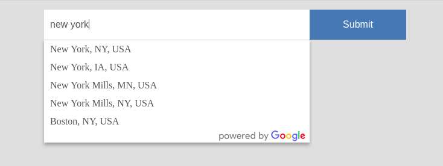

# Google Places Autocomplete

This is just an example of how to implement an autocomplete list for an address input (in this
case cities) using AMP and Google Places Autocomplete APIs. It is based on the [Autosuggest](https://ampbyexample.com/advanced/autosuggest/) example.

Requirements
------------

1. An API key for Google Places. You can get one here:

   https://developers.google.com/places/web-service/get-api-key

2. A CORS endpoint to request autocomplete info from the 
   [Place Autocomplet API](https://developers.google.com/places/web-service/autocomplete).
   For example, see [`autocomplete-api.php`](autocomplete-api.php).

3. Google [requires](https://developers.google.com/places/web-service/policies#logo_requirements)
   inclusion of a "Powered by Google" logo somewhere in the autocomplete dropdown. In this example
   it's included at the bottom of the dropdown similar to the official (non-AMP) autocomplete
   by Google.